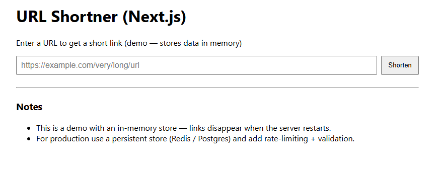

# URL Shortner - [Next.js](https://nextjs.org)

## Description
A minimal Next.js project that demonstrates a tiny URL shortener with an in-memory store.

## How to run
1. Install dependencies: `npm install`
2. Run dev server: `npm run dev`
3. Open http://localhost:3000

## Notes
- This uses an in-memory map. Data will be lost when the server restarts.
- For production, replace the in-memory store with a database (Redis, PostgreSQL, etc.)

